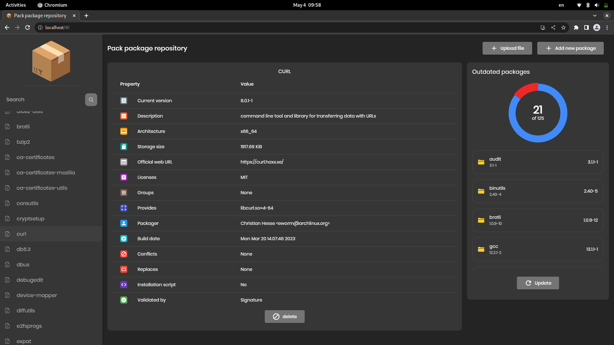

<p align="center">

</p>

<h2 align="center">Pacman package repository - repo</h2>

[](https://fmnx.io/dev/repo/src/branch/main/LICENSE)
[](https://fmnx.io/dev/repo)
[](https://github.com/fmnx-io/repo)
[](https://fmnx.io/dev/-/packages/container/repo/latest)
[](https://ci.fmnx.io/dev/repo)

Dockerized pacman repository with friendly user interface and public API. Project goal is to quickly set up personal pacman repostitory without pain and hustle. Base styling is provided to keep in sync with modern gnome apps.



---

## Configurations

Environment variables/flags:

- 📄 - `FMNXREPO_REPO` - `repo` - repository name on the web page
- 😀 - `FMNXREPO_USER` - `user` - user name in system, will be used to eject `yay` packages
- 🌐 - `FMNXREPO_PORT` - `port` - publically exposed port, `8080` default
- 📫 - `FMNXREPO_API_ADRESS` - `api-adress` - adress for backend api calls via `grpc-web`
- 📦 - `FMNXREPO_INIT_PKGS` - `init-pkgs` - initial packages to download on start
- 📥 - `FMNXREPO_INIT_PKGS_LINKS` - `init-pkgs-links` - initial packages to download using links, separated with space
- 📒 - `FMNXREPO_LOGS_FORMAT` - `logs-fmt` - format for logs (can be text/json/pretty)
- 📂 - `FMNXREPO_WEB_DIR` - `web-dir` - directory with flutter web app
- 🔐 - `FMNXREPO_LOGINS` - `logins` - list of logins and passwords separated by '|' symbol

---

## Deploy

- with `docker`:

```sh
docker run -p 8080:8080 -e FMNXREPO_LOGS_FMT=text fmnx.io/dev/repo:latest
```

- with `docker-compose`:

```yml
services:
  pacman:
    image: fmnx.io/dev/repo:latest
    command: run
    environment:
      FMNXREPO_INIT_PKGS: yay
      FMNXREPO_API_ADRESS: http://localhost:8080/
      FMNXREPO_LOGS_FMT: text
      FMNXREPO_LOGINS: user1|pass1|user2|pass2
    ports:
      - 8080:8080
```

## Add to pacman conf

Add those lines to your `/etc/pacman.conf`, to get things to work:

```conf
[localhost]
SigLevel = Optional TrustAll
Server = http://localhost:8080/pkg
```

You can test it with this commands:

```sh
sudo pacman -R yay
sudo pacman -Sy yay
```

## Contribute

For applicaiton development you need to install following software:

- `go`
- `gofumpt`
- `golangci-lint`
- `buf`
- `flutter`
- `flutter webkit`

All frontend dart code is located in `lib` folder, all backend go code is
located in `cmd` folder.

<!--
Добавить установку пакетов загруженных из ссылок
Добавить ui для загрузки пакетов через ссылки
Добавить файл конфигурации который будет автоматически изменяться с поступающими командами для возможности бэкапа в слуаче проблем
Добавить OAuth через сторонние приложения акки гити
Добавить удаление пактов через апи
Добавить tree view для просмотра зависимостей пакетов
-->
